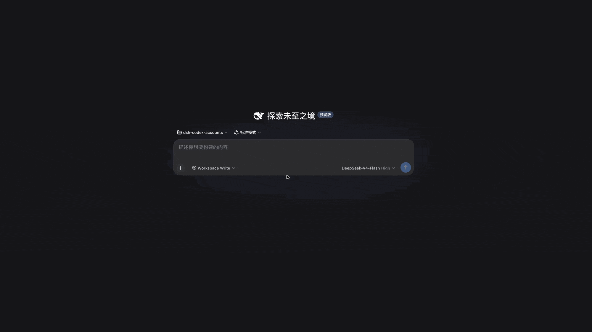
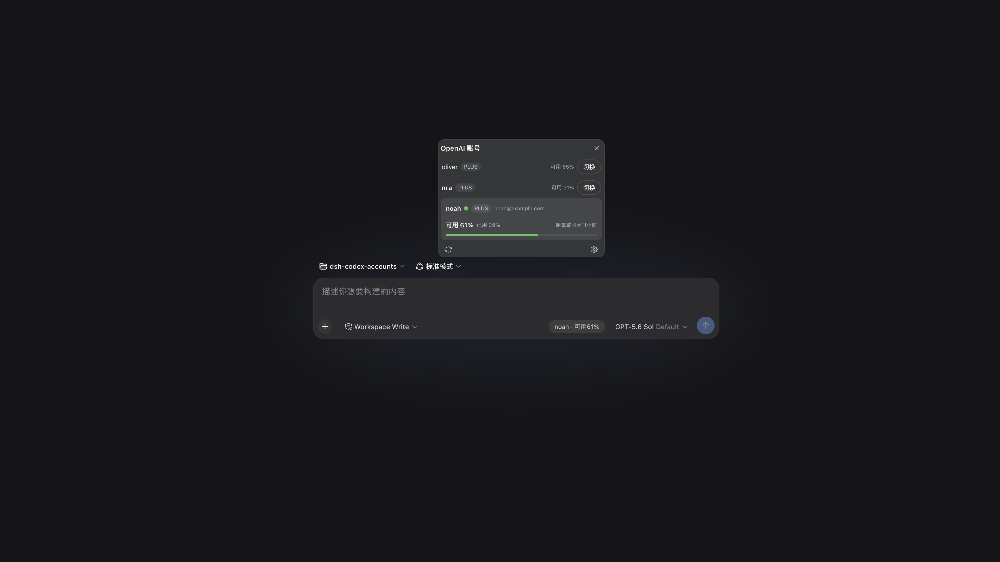
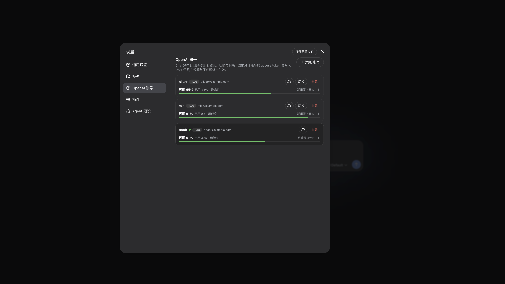

# dsh-openai-accounts

> ⚠️ **个人自用项目**:本插件按作者个人使用场景开发与维护,非官方项目,不承诺
> 持续维护、接口稳定或向后兼容。使用前请自行阅读源码,风险自负。

DSH(DeepSeek Harness)的 ChatGPT **订阅账号**(Plus / Pro 等,含 Codex)多账号管理插件。



| 对话额度胶囊与快捷切换 | 设置页账号管理 |
| --- | --- |
|  |  |

## 功能特性

- **多账号切换**:多组 ChatGPT 订阅 OAuth 凭据,一键切换;当前激活账号的 access token 写入
  `DSH_CODEX_TOKEN`,主代理与子代理统一生效。
- **官方浏览器授权登录**:复用 pi-ai `openai-codex` provider 的官方授权流程,点击登录直接
  弹出授权页,完成授权自动继续;token 到期自动刷新(切换时 + 每个模型请求前惰性检查)。
- **额度实时查看**:经 `chatgpt.com` 的 `wham/usage` 端点展示每个账号的订阅计划、可用额度、
  已用比例与重置倒计时;输入栏额度胶囊每 5 分钟自动刷新,无需点击。
- **输入栏快捷面板**:当前模型走 `openai-codex` 路由时,输入栏右侧显示「账号名 · 可用%」
  胶囊,点击弹出快捷查看与快速切换。
- **零侵入**:复用 DSH 现有 `llm-pi-ai` 的 `openai-codex` provider 路由,不注册新 provider、
  不修改框架源码。

## 安装

发布到 npm 后,用 `dsh plugin` 安装(它转发 pnpm 到 profile 目录,并自动把声明了
`dsh.bundle` 的依赖追加进 `dsh.profile.bundles`):

```sh
# pnpm 8 的 workspace-root 保护需要 -w(--workspace-root);
# 若你的 dsh/pnpm 版本不需要,可去掉 -w
dsh plugin --profile web add -w dsh-openai-accounts
```

也支持从本地目录或 Git 安装:

```sh
dsh plugin --profile web add -w ./dsh-openai-accounts
# 或
dsh plugin --profile web add -w github:you/dsh-openai-accounts
```

安装后重启 dsh 即可——无需手动软链、无需 `--patch`(插件的 `cordis.patch.yml`
作为 bundle layer 自动应用)。

## 配置

模型请求通过 DSH 现有的 `llm-pi-ai` 的 `openai-codex` provider 路由消费激活账号的
access token。在 `~/.dsh/settings.yaml` 配置:

```yaml
llm-pi-ai:
  providers:
    openai-codex:
      apiKeyEnv: DSH_CODEX_TOKEN
```

## 使用

1. 打开 **设置 → OpenAI 账号**,点击右上角「添加账号」,输入别名(如 `apps`)。
2. 点击「开始登录」,浏览器自动弹出官方授权页;完成授权后页面自动继续(本地回调
   服务器监听 `127.0.0.1`,需要本机可访问该地址)。
3. 第一个账号自动激活;后续账号可在列表中一键切换,激活账号以绿色圆点标识。
4. 在模型选择器选中 `openai-codex` 下的模型后,输入栏右侧出现额度胶囊,点击可快捷
   查看各账号可用额度并切换。
5. 长会话中 token 过期时,请求前自动刷新,无需手动干预。

## 数据存储

全部经 DSH `credentials` 服务,落在 `$DSH_HOME/.credentials.yaml`(0600 私有,跨重启持久化):

| 凭据引用 | 内容 |
| --- | --- |
| `DSH_OPENAI_ACCOUNTS_INDEX` | `{ version:1, active, accounts:[{alias, hint}] }`(hint = token 尾 4 位) |
| `DSH_OPENAI_KEY_<ALIAS>` | JSON OAuth 凭据 `{access, refresh, expires, accountId?}` |
| `DSH_CODEX_TOKEN` | 当前激活账号的 access token(切换目标,llm-pi-ai 每请求读取) |

## 卸载

```sh
dsh plugin --profile web remove dsh-openai-accounts
```

## 故障排查

- **设置页/输入栏胶囊不出现**:确认插件已安装且 `dsh --profile web --dump-config`
  输出中包含 `dsh-openai-accounts` 层。
- **登录无反应**:检查 dsh 日志中的 pi-ai OAuth 报错(网络 / 账号权限)。
- **切换报「被环境变量遮蔽」**:进程环境中存在 `DSH_CODEX_TOKEN` 环境变量时,凭据写入
  会被显式拒绝。启动 dsh 前 `unset DSH_CODEX_TOKEN` 即可。
- **额度显示异常**:确认订阅账号有效;额度端点(`wham/usage`)偶尔被上游限流时,稍后
  点击 ⟳ 重试。

## 开发

```
dsh-openai-accounts/
├── package.json      # dsh.bundle(加载层)+ dsh.client(Web 客户端声明)
├── cordis.patch.yml  # bundle 层:插入插件行(可配置覆盖凭据引用名)
├── src/
│   ├── host.ts       # Host:凭据存储 + 切换/刷新/用量 + openaiAccounts Remote 服务
│   ├── oauth.ts      # Provider-owned OAuth:复用 pi-ai 官方浏览器授权/刷新
│   ├── typert.ts     # Host 侧 Typert 描述符(与 descriptors.ts 共享构造)
│   ├── descriptors.ts# Remote 描述符构造(Host 与 Client 共用)
│   └── client.ts     # Client:browser bundle(设置页 + 输入栏额度胶囊 + 登录轮询)
├── build.mjs         # 构建:tsc → esbuild(仅 external: react)→ __ModuleLoader__ 闭包
├── assets/           # README 截图与演示
└── README.md
```

```sh
npm install
npm run build
```

- Client 改动:刷新浏览器即可生效;Host 改动:重启 dsh(web 表面 HMR 被上游禁用)。
- 依赖说明:以 peerDependencies 复用 DSH 运行时提供的 `@deepseek-ai/cordis` 与
  `@deepseek-ai/dsh-typert-protocol`;`@earendil-works/pi-ai` 作为 dependencies 随包
  安装,版本对齐 DSH 的 `llm-pi-ai`。

## 许可证

[MIT](LICENSE)
